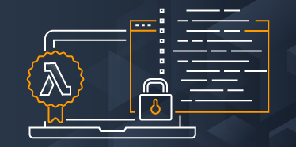

<p align="center">
  
</p>
<h1 style="font-size: 56px; margin: 0; padding: 0;" align="center">
  aws-lambda-code-signing-action
</h1>
<p align="center">
  
  <a href="http://commitizen.github.io/cz-cli/" alt="commitizen cli">
    
  </a>
  <a href="https://snyk.io/test/github/clowdhaus/aws-lambda-code-signing-action">
    
  </a>
</p>
<p align="center">
  <a href="https://github.com/clowdhaus/aws-lambda-code-signing-action/actions?query=workflow%3Aintegration">
    
  </a>
</p>

GitHub action which uses AWS Code Signer to sign 🔒 AWS Lambda artifacts 📦 from your pipeline.

## Usage

See the [AWS documenation](https://docs.aws.amazon.com/lambda/latest/dg/configuration-codesigning.html) for all details related to code signing AWS Lambda artifacts.

```yml
- uses: clowdhaus/aws-lambda-code-signing-action/@main
  with:
    # TODO
```

## Getting Started

The following instructions will help you get setup for development and testing purposes.

### Prerequisites

#### [yarn](https://github.com/yarnpkg/yarn)

`yarn` is used to handle dependencies and executing scripts on the codebase.

See [here](https://yarnpkg.com/en/docs/install#debian-stable) for instructions on installing yarn on your local machine.

Once you have installed `yarn`, you can install the project dependencies by running the following command from within the project root directory:

```bash
  $ yarn
```

## Contributing

Please read [CODE_OF_CONDUCT.md](.github/CODE_OF_CONDUCT.md) for details on our code of conduct and the process for submitting pull requests.

## Changelog

Please see the [CHANGELOG.md](CHANGELOG.md) for details on individual releases.
